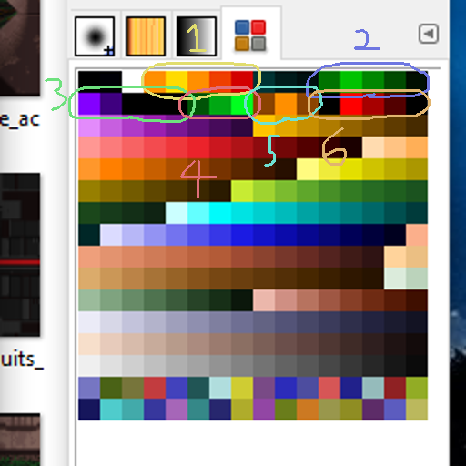
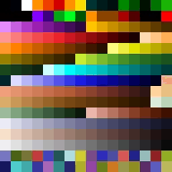

# Palette Rotation
Bitmap files sometimes map pixel colors to those defined by a palette of limited colors, most notably the standard 255-colors. In order to animate some assets, some games would rotate values on the palette of bitmap images.

## Task
Take a bunch of game bitmap assets, rotate the palette, and export the frames accordingly.

## Learning Outcomes
- Editing binary data in PHP
- PHP string replacement with arrays
- PHP DirectoryIterator
- BMP file format

## Code Considerations
- Bitmap files must be placed in a `textures` directory
- The `rotated` directory must exist
- There's absolutely no error correction
- `textures` and `rotated` should contain images, though in this repository they contain archives of the images because otherwise it becomes hell

Task and reference images supplied by [@Rancore202](http://t.me/rancore202) on Telegram.
